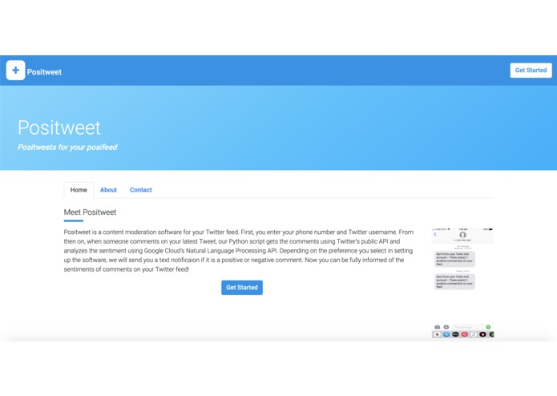
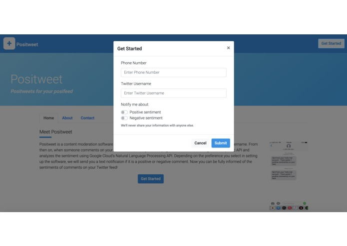
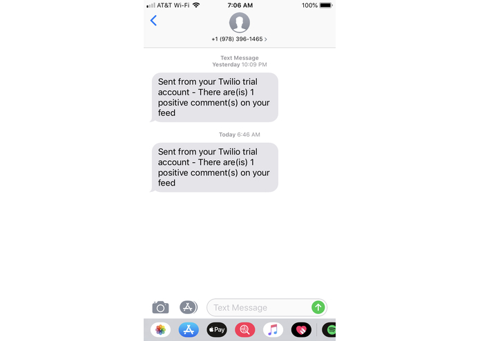

<div class="ui small rounded images">
  
  
  
</div>

My team developed an application that notified users if they had negative tweets on their twitter account.

Here is some code that illustrates how we read values from the line sensors:

```js
byte ADCRead(byte ch)
{
    word value;
    ADC1SC1 = ch;
    while (ADC1SC1_COCO != 1)
    {   // wait until ADC conversion is completed   
    }
    return ADC1RL;  // lower 8-bit value out of 10-bit data from the ADC
}
```

You can learn more on [Devpost](https://devpost.com/software/positweet-ijdez1).


